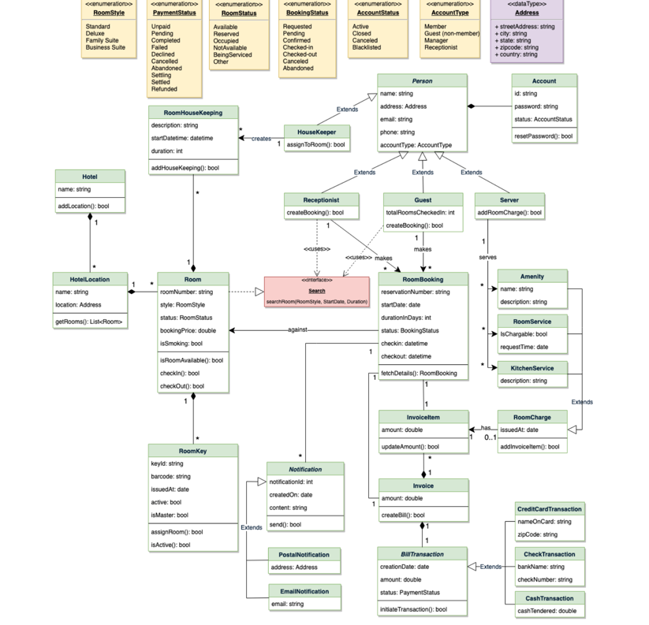

# Hotel Management System
System Requirements
We’ll focus on the following set of requirements while designing the Hotel
Management System:
1. The system should support the booking of different room types like
   standard, deluxe, family suite, etc.
2. Guests should be able to search the room inventory and book any
   available room.
3. The system should be able to retrieve information, such as who booked a
   particular room, or what rooms were booked by a specific customer.
4. The system should allow customers to cancel their booking - and provide
   them with a full refund if the cancelation occurs before 24 hours of the
   check-in date.
5. The system should be able to send notifications whenever the booking is
   nearing the check-in or check-out date.
6. The system should maintain a room housekeeping log to keep track of all
         housekeeping tasks.
7. Any customer should be able to add room services and food items.
8. Customers can ask for different amenities.
9. The customers should be able to pay their bills through credit card, check
   or cash.

Class Diagram

- Try to find the actors and their usecases from the requirements
- The Amentities and Room Service can follow the decorator Pattern.

Reference:
- Grokking the OOPs
- https://youtu.be/5VWycK8KmW0?si=D5-3Z9qIdxLq8FHu